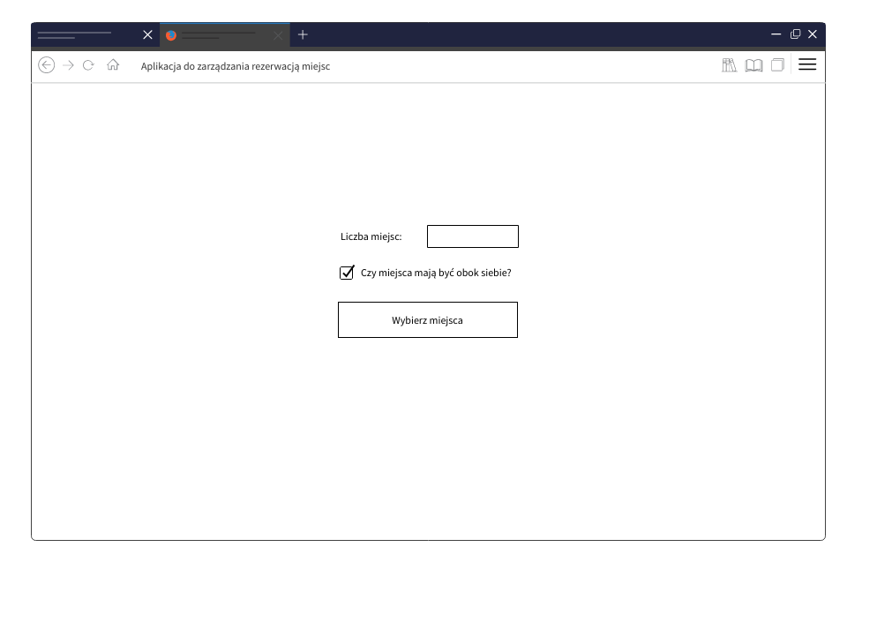

# seat-reservation
## Aplikacja do zarzÄ…dzania rezerwacjÄ… miejsc.

### Cel zadania
Celem zadania jest stworzenie aplikacji internetowej, wykorzystujÄ…c biblioteki: React, Redux (lub inne rozwiÄ…zanie implementujÄ…ce architekturÄ™ flux) oraz dowolny wybrany przez siebie istniejÄ…cy design system (np. ant.design).
W repozytorium, w katalogu mockups znajdziesz wizualizacje poszczególnych stron, które powinny zostać zaimplementowane w aplikacji.

Mile widziane będzie pokrycie kluczowych funkcjonalności testami jednostkowymi.

Rozpoczynając prace polecamy skorzystać z generatora dostarczonego przez React, wykorzystując szablon redux:
```
npx create-react-app my-app --template redux
```

### Wytyczne

W pierwszym etapie aplikacja powinna pytać o liczbę miejsc do zarezerwowania oraz czy miejsca powinny być obok siebie (patrz wizualizacja poniżej).



Następnie należy pobrać z API dostępne miejsca. W repozytorium dostępny jest przykładowy serwer, który można uruchomić za pomocą:  
```
npm run api
```

Powyżej wspomniany serwer dostarcza endpoint `/seats`, który zwraca wszystkie miejsca oraz ich położenie. Jedno miejsce posiada następujące informacje:
```javascript
const seat = {
   id: 's01', // id miejsca
   cords: { // koordynaty, liczone od zera
      x: 0,
      y: 1,
   },
   reserved: false, // boolean - czy miejsce jest już zarezerwowane
};
```

Na podstawie tych danych, powinna zostać wyświetlona graficzna reprezentacja sali (patrz wizualizacja poniżej).


Aplikacja na tym etapie powinna proponować miejsca użytkownikowi. Jeżeli została wybrana opcja, że miejsca powinny znajdować się obok siebie, należy zaproponować takie miejsca, które nie będą oddzielone od siebie pustą przestrzenią oraz innym, już zajętym miejscem.

Dodatkowo widok sali powinien być "klikalny" - powinna istnieć możliwość edycji i ponownego wyboru miejsc. Operacje użytkownik zatwierdza przyciskiem „Rezerwuj” (stan rezerwacji należy zapamiętać wyłącznie lokalnie, w store).

Na koniec powinna zostać wyświetlona strona z podsumowaniem (wizualizacja poniżej)


