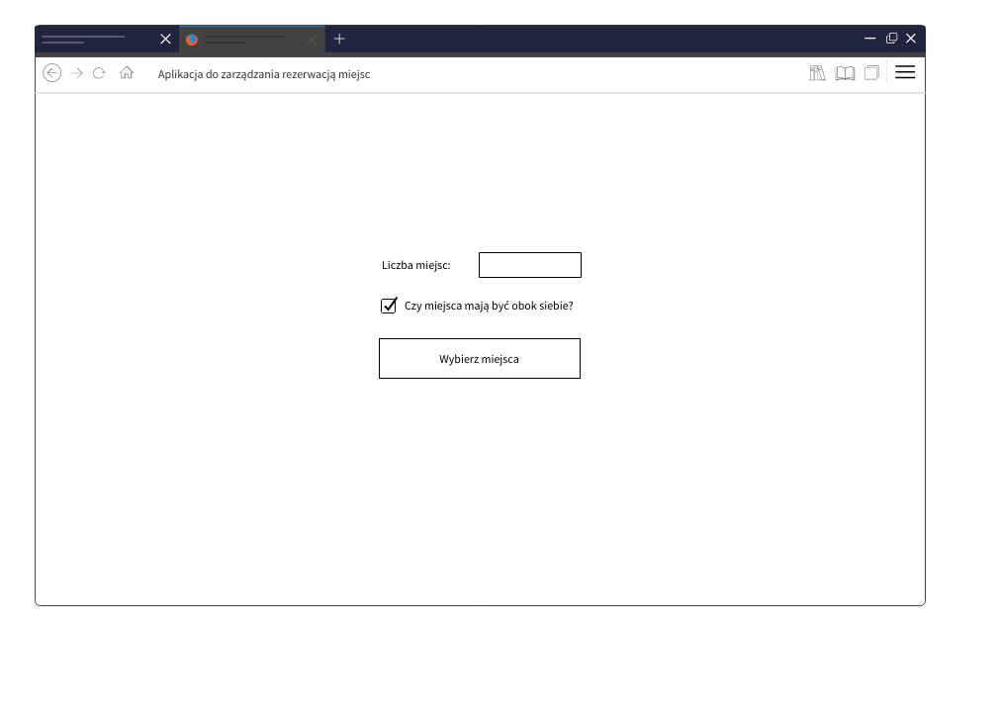
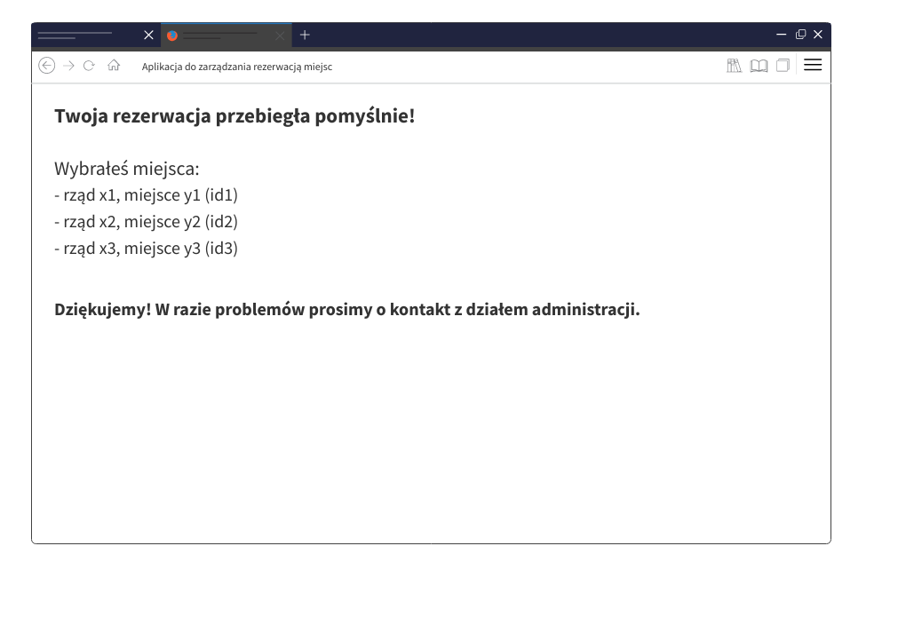

## Aplikacja do zarządzania rezerwacją miejsc.

### Cel zadania
Celem zadania jest stworzenie aplikacji internetowej, wykorzystując biblioteki: React, Redux (lub inne rozwiązanie implementujące architekturę flux) oraz dowolny wybrany przez siebie istniejący design system (np. ant.design).
W repozytorium, w katalogu mockups znajdziesz wizualizacje poszczególnych stron, które powinny zostać zaimplementowane w aplikacji.

Mile widziane będzie pokrycie kluczowych funkcjonalności testami jednostkowymi.

Rozpoczynając prace polecamy skorzystać z generatora dostarczonego przez React, wykorzystując szablon redux:
```
npx create-react-app my-app --template redux
```

### Wytyczne

W pierwszym etapie aplikacja powinna pytać o liczbę miejsc do zarezerwowania oraz czy miejsca powinny być obok siebie (patrz wizualizacja poniżej).



Następnie należy pobrać z API dostępne miejsca. W repozytorium dostępny jest przykładowy serwer, który można uruchomić za pomocą:  
```
npm run api
```

Powyżej wspomniany serwer dostarcza endpoint `/seats`, który zwraca wszystkie miejsca oraz ich położenie. Jedno miejsce posiada następujące informacje:
```javascript
const seat = {
   id: 's01', // id miejsca
   cords: { // koordynaty, liczone od zera
      x: 0,
      y: 1,
   },
   reserved: false, // boolean - czy miejsce jest już zarezerwowane
};
```

Na podstawie tych danych, powinna zostać wyświetlona graficzna reprezentacja sali (patrz wizualizacja poniżej).


Aplikacja na tym etapie powinna proponować miejsca użytkownikowi. Jeżeli została wybrana opcja, że miejsca powinny znajdować się obok siebie, należy zaproponować takie miejsca, które nie będą oddzielone od siebie pustą przestrzenią oraz innym, już zajętym miejscem.

Dodatkowo widok sali powinien być "klikalny" - powinna istnieć możliwość edycji i ponownego wyboru miejsc. Operacje użytkownik zatwierdza przyciskiem „Rezerwuj” (stan rezerwacji należy zapamiętać wyłącznie lokalnie, w store).

Na koniec powinna zostać wyświetlona strona z podsumowaniem (wizualizacja poniżej)




This project was bootstrapped with [Create React App](https://github.com/facebook/create-react-app), using the [Redux](https://redux.js.org/) and [Redux Toolkit](https://redux-toolkit.js.org/) template.

## Available Scripts

In the project directory, you can run:

### `npm start`

Runs the app in the development mode.<br />
Open [http://localhost:3000](http://localhost:3000) to view it in the browser.

The page will reload if you make edits.<br />
You will also see any lint errors in the console.

### `npm test`

Launches the test runner in the interactive watch mode.<br />
See the section about [running tests](https://facebook.github.io/create-react-app/docs/running-tests) for more information.

### `npm run build`

Builds the app for production to the `build` folder.<br />
It correctly bundles React in production mode and optimizes the build for the best performance.

The build is minified and the filenames include the hashes.<br />
Your app is ready to be deployed!

See the section about [deployment](https://facebook.github.io/create-react-app/docs/deployment) for more information.

### `npm run eject`

**Note: this is a one-way operation. Once you `eject`, you can’t go back!**

If you aren’t satisfied with the build tool and configuration choices, you can `eject` at any time. This command will remove the single build dependency from your project.

Instead, it will copy all the configuration files and the transitive dependencies (webpack, Babel, ESLint, etc) right into your project so you have full control over them. All of the commands except `eject` will still work, but they will point to the copied scripts so you can tweak them. At this point you’re on your own.

You don’t have to ever use `eject`. The curated feature set is suitable for small and middle deployments, and you shouldn’t feel obligated to use this feature. However we understand that this tool wouldn’t be useful if you couldn’t customize it when you are ready for it.

## Learn More

You can learn more in the [Create React App documentation](https://facebook.github.io/create-react-app/docs/getting-started).

To learn React, check out the [React documentation](https://reactjs.org/).
